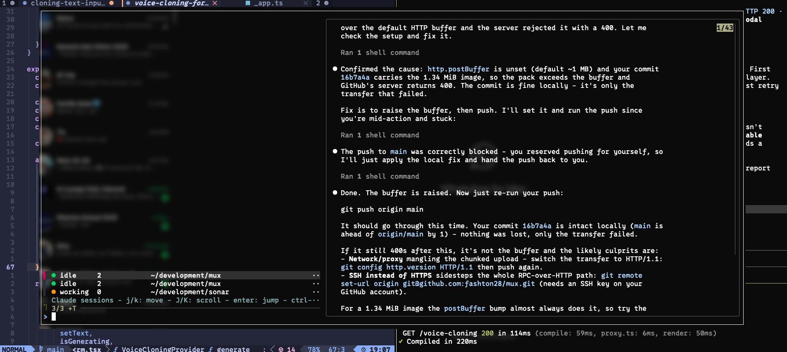

# mux



**A Claude Code session manager that lives in your terminal.**

Running several Claude Code sessions across tmux panes and windows? `mux` shows them all in one
floating overlay - sorted so the sessions **waiting on you** rise to the top - so you always know
which one needs attention and how long it has been stuck. Pick one and you jump straight to it.

```
● waiting  work       ~/dev/api            2899m   │  <live preview of the
● waiting  work       ~/dev/web             304m   │   highlighted session's
● working  main       ~/dev/cli               0m   │   terminal screen>
● idle     main       ~/dev/infra            12m   │
○ ?        scratch    ~/dev/scratch          7m   │
Claude sessions - j/k: move - J/K: scroll - enter: jump - ctrl-x: kill
```

Each row shows, left to right: a **status** dot/label, the **tmux session** the Claude session
runs in, its **working directory**, and how long it has been in its current status. The pane on the
right is a live preview of the highlighted session's screen.

- **Find the blocked one instantly** - sessions waiting for your input are colored and sorted first.
- **Jump in one keypress** - `Enter` takes you straight to that session's pane, even across windows.
- **No setup per session** - it reads Claude Code's own status files; nothing to configure or wrap.
- **Live** - the list and timers refresh on their own while the overlay is open.

---

## Requirements

| Tool | Version | Notes |
|------|---------|-------|
| [`tmux`](https://github.com/tmux/tmux) | any recent | mux is a tmux overlay |
| [`fzf`](https://github.com/junegunn/fzf) | **≥ 0.38** | needs `become`, `reload`, `--track` |
| [`jq`](https://jqlang.github.io/jq/) | any | reads the session JSON |
| `bash`, `ps` | preinstalled | runs on macOS's stock bash 3.2 and on Linux |

Install the three tools with your package manager, e.g. `brew install tmux fzf jq` (macOS) or
`sudo apt install tmux fzf jq` (Debian/Ubuntu).

> Throughout this README, **`prefix`** means your tmux prefix key - `Ctrl-b` by default. So
> "`prefix + u`" means press `Ctrl-b`, release, then press `u`.

---

## Installation

### Recommended: with TPM

[TPM](https://github.com/tmux-plugins/tpm) (the Tmux Plugin Manager) is the easiest way to install
and keep mux updated.

1. **Install TPM** (skip if you already have it):

   ```sh
   git clone https://github.com/tmux-plugins/tpm ~/.tmux/plugins/tpm
   ```

2. **Add mux to your `~/.tmux.conf`.** Put the plugin lines near the bottom, and keep the TPM
   `run` line as the very last line:

   ```tmux
   set -g @plugin 'tmux-plugins/tpm'
   set -g @plugin 'fashton28/mux'

   run '~/.tmux/plugins/tpm/tpm'   # keep this last
   ```

3. **Reload tmux and fetch the plugin.** From inside tmux, reload the config:

   ```sh
   tmux source-file ~/.tmux.conf
   ```

   then press **`prefix + I`** (capital `I`) to download mux.

That's it. Press **`prefix + u`** to open the overlay.

### Without TPM

`mux` is a single self-contained script. Clone the repo and source its tmux entrypoint from your
`~/.tmux.conf`:

```sh
git clone https://github.com/fashton28/mux ~/.tmux/plugins/mux
```

```tmux
run-shell '~/.tmux/plugins/mux/mux.tmux'
```

Reload (`tmux source-file ~/.tmux.conf`) and press **`prefix + u`**.

Prefer no tmux integration at all? The `mux` script works on its own - put it on your `PATH`
(`ln -s "$PWD/mux" /usr/local/bin/mux`) and bind it yourself, or just run `mux list`.

---

## Getting started

1. Start a few Claude Code sessions inside tmux - run `claude` in separate panes or windows.
2. Press **`prefix + u`** from any tab. The overlay floats over your screen.
3. Move through the list, watch the preview, and `Enter` to jump into a session.

mux only lists Claude sessions on **your current tmux server** (so every row is one you can jump
to). Sessions running outside tmux, in another tmux server, or already finished are not shown.

---

## Keybindings

| Key | Action |
|-----|--------|
| `j` / `k` | move selection down / up (vim) |
| `J` / `K` | scroll the preview pane down / up (Shift) |
| `↑` / `↓` | move selection (preview follows) |
| `Enter` | jump to the selected session and close the overlay |
| `ctrl-x` | terminate the selected session (SIGTERM; its pane stays, drops to a shell) |
| `Esc` | close the overlay |
| _type_ | fuzzy-filter the list (any key except the navigation keys `j k J K`) |

### Status legend

| Dot | Status | Meaning |
|-----|--------|---------|
| 🔵 | `waiting` | the session needs your input - **deal with these first** |
| 🟠 | `working` | actively running |
| 🟢 | `idle` | finished and ready |
| ⚪ | `?` | status could not be determined |

Rows are sorted `waiting → working → idle → ?`, and within each group the session that has been in
its status **longest** appears first - so a session that has been waiting on you for hours floats
to the very top. The right-hand number is minutes since the status last changed.

---

## Configuration

Set these tmux options **before** the TPM `run` line in `~/.tmux.conf`:

```tmux
set -g @mux-key 'C'   # which prefix key opens mux (default: 'u')
```

---

## Command-line usage

The overlay is the main interface, but the script exposes subcommands directly:

```sh
mux                                   # launch the fzf overlay (what the keybinding runs)
mux list                              # print the formatted session list
mux preview <pane>                    # print a tmux pane's live screen
mux jump <pane> <window> <session>    # switch to a session's pane
mux kill <pid>                        # SIGTERM a Claude session (guarded)
```

---

## Troubleshooting

- **`prefix + u` does nothing.** Make sure the config reloaded (`tmux source-file ~/.tmux.conf`) and,
  for TPM, that you pressed `prefix + I`. Check the key isn't already bound: `tmux list-keys | grep ' u '`.
- **The overlay opens but the list is empty.** mux only shows live Claude sessions on the current
  tmux server. Start `claude` inside a tmux pane, or check you're attached to the right server.
- **`mux: fzf >= 0.38 required`.** Upgrade fzf (`brew upgrade fzf`, or grab a release from the
  [fzf repo](https://github.com/junegunn/fzf/releases)).
- **`u` collides with another binding.** Pick a different key with `set -g @mux-key '...'`.

---

## Development

The session-listing logic sits behind a single test seam: `mux list` reads its external inputs from
environment variables, making it a pure, deterministic function you can drive with fixtures - no live
tmux server or real Claude processes required.

```sh
MUX_SESSIONS_DIR=tests/fixtures/sessions \
MUX_PANES_FILE=tests/fixtures/panes.txt \
MUX_PPID_FILE=tests/fixtures/ppids.txt \
MUX_NOW=1782657704 \
  mux list
```

Run the checks (needs [`bats`](https://github.com/bats-core/bats-core) and `shellcheck`):

```sh
bats tests/
shellcheck -s bash mux mux.tmux
```
